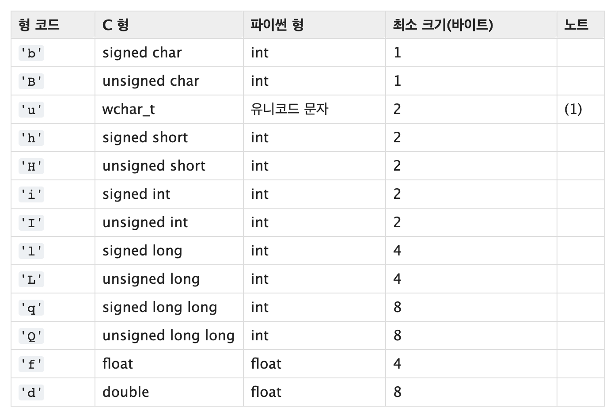

오늘은 파이썬의 시퀀스(Sequence)에 대해 얘기를 해볼까 합니다.

## 파이썬의 시퀀스란?

파이썬에서 시퀀스란 대체로 ordered-set을 말합니다. 간단히 설명했을 때 순서를 가지고 나열되어 있는 객체라고 이해하면 쉽습니다. 시퀀스는 크게 Container형과 Flat형, 그리고 가변형(mutable)과 불변형(immutable)로 나뉩니다.

## Container vs Flat?

Container형은 서로 다른 자료 형을 담을 수가 있습니다. 쉽게 설명하자면 a라는 리스트에 int, float, str을 모두 쓸 수 있다고 설명하는게 이해가 쉬울 수 있겠죠?
a = [ 1, 1.0, '1']

이러한 컨테이너형 종류에는 **list, tuple, collections.deque** 등이 있습니다.

Flat형은 Container형과 반대되는 개념입니다. Container형은 하나에 서로 다른 자료 형을 담을 수가 있었다면 Flat은 한 개의 자료형만 담을 수 있습니다.

이러한 컨테이너 형의 종류에는 **str, bytes, bytearray, array.array, memoryview** 등이 있습니다.

## Mutable vs Immutable?

mutable은 한 번 선언했어도 게속 변경할 수 있는 가변형이고, 예로는 list, bytearray, array.array. memoryview, deque가 있습니다.

반대로 immutable은 한 번 선언하면 더 이상 변경할 수 없고, 예로는 tuple, str, bytes 등이 있습니다.

```python
chars = '+_)(*&^%$#@!'
# chars[2] = 'h' # TypeError: 'str' object does not support item assignment
```

만약 chars 변수에서 특정 스트링을 바꾸려고 하면 오류가 발생합니다. str은 flat이자 immutable이기 때문에 한 번 선언한 후 다시 바꿀 수 없습니다.

## List Comprehension

List Comprehension은 쉽게 말해 리스트를 짧게 만들 수 있는 파이썬의 기능입니다.

```python
for s in chars:
    code_list1.append(ord(s)) # ord() : 문자의 아스키 코드 값을 돌려주는 함수
print(code_list1)  # [43, 95, 41, 40, 42, 38, 94, 37, 36, 35, 64, 33]
```

```python
code_list2 = [ord(s) for s in chars] # ord() : 문자의 아스키 코드 값을 돌려주는 함수
print(code_list2)  # [43, 95, 41, 40, 42, 38, 94, 37, 36, 35, 64, 33]
```

두 개의 리스트 결과 값은 다른데 코드 양 차이가 느껴지시나요? 코드가 길어질 수록 list comprehension 길이가 더 짧아질 겁니다.

list comprehension에 Map과 Filter를 추가할 수도 있습니다.

```python
code_list3 = [ord(s) for s in chars if ord(s) > 40]
code_list4 = list(filter(lambda x: x > 40, map(ord, chars)))
print(code_list3)  # [43, 95, 41, 42, 94, 64]
print(code_list4)  # [43, 95, 41, 42, 94, 64]
```

```python
print([chr(s) for s in code_list1]) # chr: 아스키 모드에서 문자로 바꿔주는 함수
# ['+', '_', ')', '(', '*', '&', '^', '%', '$', '#', '@', '!']
print([chr(s) for s in code_list2])
# ['+', '_', ')', '(', '*', '&', '^', '%', '$', '#', '@', '!']
print([chr(s) for s in code_list3])
# ['+', '_', ')', '*', '^', '@']
print([chr(s) for s in code_list4])
# ['+', '_', ')', '*', '^', '@']
```

## Generator?

generator는 간단하게 설명하면 iterator를 생성해주는 function이고, iterator는 next()메소드를 이용해 데이터를 순차적으로 접근이 가능하게 하는 object입니다. 파이썬에서 성능 및 효율적으로 코드를 작성하기 위해 제네레이터 패턴을 많이 사용합니다. 배열이나 리스트와 같은 반복가능한 연속적인 값들을 생성해내는 패턴이고 가장 중요한 점은 모든 값을 포함하여 반환하는 대신 호출할 때마다 한 개의 값을 리턴합니다. 때문에 아주 작은 메모리로 효율적 대용량 반복가능한 구조를 순회할 수 있고 메모리 유지가 되지 않습니다.

결국 generator는 다음에 내가 반환해야 하는 값만 가지고 있다는 뜻!

https://docs.python.org/ko/3/library/array.html

```python
code_list = [ord(s) for s in chars]
print(code_list) # [43, 95, 41, 40, 42, 38, 94, 37, 36, 35, 64, 33]
tuple_g = (ord(s) for s in chars)
print(tuple_g) # <generator object <genexpr> at 0x7ffa59270970>
print(type(tuple_g))  # <class 'generator'>
print(next(tuple_g))  # 43
```

code_list와 같이 tuple generator가 아닌 list comprehension으로 만들면 값을 만들어버리기 때문에 메모리를 차지합니다. 하지만 tuple_g처럼 generator로 만들면 아직 값을 생성하지 않은 상태이고 다음 값을 반환할 준비만 하고 있습니다. 그래서 next()를 통해 다음 값을 생성할 수 있습니다.

이제는 list generation을 만들어보겠습니다. 일단 파이썬에서 array를 사용하려면 모듈을 import해줘야 하는데 저는 array 모듈을 사용하겠습니다. 참고로 numpy라는 모듈을 활용해 array를 만들 수도 있습니다.



array는 위에 설명했듯이 Flat형이기 때문에 한 개의 자료형만 담아야 합니다. 사진을 참고해 코드 타입을 정해주시면 됩니다.  
더 자세히 알아보고 싶으신 분은 < https://docs.python.org/ko/3/library/array.html > 링크를 참고해주세요!

```python
import array

array_g = array.array('I', (ord(s) for s in chars))
print(array_g)  # array('I', [43, 95, 41, 40, 42, 38, 94, 37, 36, 35, 64, 33])
print(type(array_g))  # <class 'array.array'>
print(array_g.tolist())  # [43, 95, 41, 40, 42, 38, 94, 37, 36, 35, 64, 33]
```

array_g를 그대로 출력해보면 array형태 그대로 출력되지만, type으로 확인해보면 class의 array형태인 것을 알 수 있습니다.

다른 generator 예제를 살펴보겠습니다. 간단히 A, B, C, D반이 있고 한 반에 20명의 학생이 있다고 생각해봅시다.

```python
print(('%s' % c + str(n) for c in ['A', 'B', 'C', 'D'] for n in range(1, 21)))
# <generator object <genexpr> at 0x10b968970>
for s in ('%s' % c + str(n) for c in ['A', 'B', 'C', 'D'] for n in range(1, 21)):
    print(s)
```

generator를 그대로 출력하면 값은 볼 수 없고, next()를 활용해라 다음 값을 알 수가 있습니다. 하지만 generator를 반복문을 통해 출력하면 80명의 학생을 모두 확인할 수 있습니다.

## deep copy vs shallow copy

copy 종류를 제대로 몰라도 단어 뜻만 보면 대충 무슨 뜻이 있는지 예상가지 않나요? 한국말 뜻대로 하면 깊은 복사, 얕은 복사가 되는 건데 어떻게 사용하는 지 알아봅시다. copy를 제대로 다루지 못하면 완전히 다른 결과가 나올 수도 있으니 주의하세요.

일단 각각 다른 방식으로 copy를 만들어보겠습니다.

```python
marks1 = [['~'] * 3 for _ in range(4)]
marks2 = [['~'] * 3] * 4
print(marks1)
# [['~', '~', '~'], ['~', '~', '~'], ['~', '~', '~'], ['~', '~', '~']]
print(marks2)
# [['~', '~', '~'], ['~', '~', '~'], ['~', '~', '~'], ['~', '~', '~']]
```

marks1은 반복문을 통해서 ['~']x3을 3번 반복했고, marks2는 ['~']x3을 그대로 4번 곱해 같은 결과를 만들었습니다.  
여기서 marks1과, marks2를 수정해보겠습니다.

```python
marks1[0][1] = 'X'
marks2[0][1] = 'X'
print(marks1)
# [['~', 'X', '~'], ['~', '~', '~'], ['~', '~', '~'], ['~', '~', '~']]
print(marks2)
# [['~', 'X', '~'], ['~', 'X', '~'], ['~', 'X', '~'], ['~', 'X', '~']]
```

marks1, marks2의 결과값이 각각 다르게 나왔습니다. mark1s는 0번째 index만 수정된 반면, mark2는 모든 index의 값이 수정됐습니댜. 이게 어떻게 된 걸까요?


왜 그런지 증명을 하기 위해 marks1, marks2의 index값마다 id를 찍어보겠습니다.

```python
print([id(i) for i in marks1])
# [4515663616, 4515663424, 4515663360, 4515663168]
print([id(i) for i in marks2])
# [4515663104, 4515663104, 4515663104, 4515663104]
```

marks1의 index값은 전부 id값이 다르지만, marks2의 값은 똑같습니다. marks1은 정확하게 복사가 됐기 때문에 주소값이 모두 다르지만, marks2는 하나의 주소값이 계속 복사가 됐기 때문에 변경된 값이 모두 똑같은걸 알 수 있습니다.

또 python의 copy 모듈을 통하면 더욱 쉽게 핸들링 할 수 있습니다.

```python
import copy
a = [[1,2],[3,4]]
b = copy.copy(a) # shallow copy
a[1].append(5)
print(a) # [[1, 2], [3, 4, 5]]
print(b) # [[1, 2], [3, 4, 5]]
```

```python
import copy
a = [[1,2],[3,4]]
b = copy.copy(a) # deep copy
a[1].append(5)
print(a) # [[1, 2], [3, 4, 5]]
print(b) # [[1, 2], [3, 4]]
```

결론적으로 shallow copy는 위의 경우와 같이 주소값을 복사하는 것이고 deep copy 는 오브젝트의 컨텐츠를 모두 복사하여 새로운 주소에 새로운 변수를 생성하므로 서로 엮이지 않습니다.
