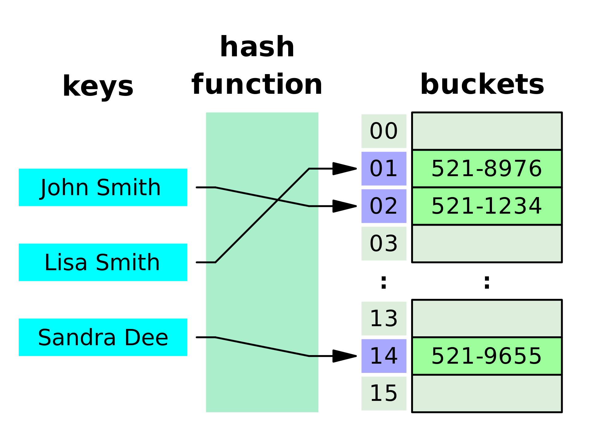

## Hash Table

오늘은 파이썬 자료구조 Hable Table에 얘기해볼까 합니다.  
해시 테이블은 데이터 요소의 주소 또는 인덱스 값이 해시 함수에서 생성되는 데이터 구조 유형입니다. 그러면 인덱스 값이 데이터 값의 키로 작동하므로 데이터에 더 빠르게 액세스 할 수 있습니다. 즉, 해시 테이블은 키-값 쌍을 저장하지만 키는 해싱 함수를 통해 생성됩니다.

따라서 키 값 자체가 데이터를 저장하는 배열의 인덱스가되므로 데이터 요소의 검색 및 삽입 기능이 훨씬 빨라집니다.


위 사진을 보면 key인 'John Smith', 'Lisa Smith', 'Sandra Dee'가 해쉬 함수를 통해 숫자로 변경되고, 생성된 해쉬 주소값을 통해 value가 저장이 됩니다.

하지만 파이썬에서는 Dictonary가 HashTable 구조이기 때문에 따로 구현할 필요가 없습니다. 따라서 Dictonary의 키도 해쉬 함수로 생성되고, Dictonary의 순서는 고정되지 않습니다.

이제 코드 예시로 확인해보겠습니다.

```python
t1 = (10, 20, (30, 40, 50))
t2 = (10, 20, [30, 40, 50])

print(hash(t1))  # 465510690262297113
print(hash(t2)) # TypeError: unhashable type: 'list'
```

왜 t2는 해쉬값을 얻을 수 없을까요? list는 값을 언제든지 수정할 수 있는 mutable 형이기 때문에 오류가 발생합니다.

## setDefault

이어서 setDefault에 대해 알아보겠습니다.

```python
dict.setdefault(key, default=None)
```

파이썬 사전 메서드 setdefault () 는 get ()과 유사하지만, 키가 dict에 아직 없으면 dict [key] = default를 설정 합니다.

```python
d1 = {'k1':'v1', 'k2':'v2', 'k3':'v3'}
print(d1.get('k4')) # None
print(d1.get('k4', 'v4')) # v4
print(d1) # {'k1':'v1', 'k2':'v2', 'k3':'v3'}
```

get() 메소드를 사용해서 k4를 가지고 올 떈 d1에 직접 추가가 되지 않습니다.

```python
d1 = {'k1':'v1', 'k2':'v2', 'k3':'v3'}
print(d1.setDefault('k4')) # None
print(d1.setDefault('k4', 'v4')) # v4
print(d1) # {'k1':'v1', 'k2':'v2', 'k3':'v3', 'k4':'v4'}
```

setDefault를 이용할 땐 k4가 원본 d1에 추가되는 것을 알 수 있습니다.

이번엔 튜플에서 딕셔너리로 만들어 보겠습니다.

```python
source = (
    ('k1', 'val1'),
    ('k1', 'val2'),
    ('k2', 'val3'),
    ('k2', 'val4'),
    ('k2', 'val5')
)

new_dict1 = {}
new_dict2 = {}

# Not use Setdefault
for k, v in source:
    if k in new_dict1:
        new_dict1[k].append(v)
    else:
        new_dict1[k] = [v]
print(new_dict1)  # {'k1': ['val1', 'val2'], 'k2': ['val3', 'val4', 'val5']}

# Use Setdefault
for k, v in source:
    new_dict2.setdefault(k, []).append(v) # k를 기준으로 리스트를 만든다.
print(new_dict2)  # {'k1': ['val1', 'val2'], 'k2': ['val3', 'val4', 'val5']}
```

튜플에서 딕셔너리로 만들 때 setDefault 속도가 더 빠릅니다.

```python
new_dict3 = {k: v for k, v in source}
print(new_dict3)  # {'k1': 'val2', 'k2': 'val5'}
```

new_dict3처럼 작성하면 key가 같을 때 value가 덮어씌어져버리기 때문에 주의하셔야 합니다.

오늘도 수고하셨습니다!
